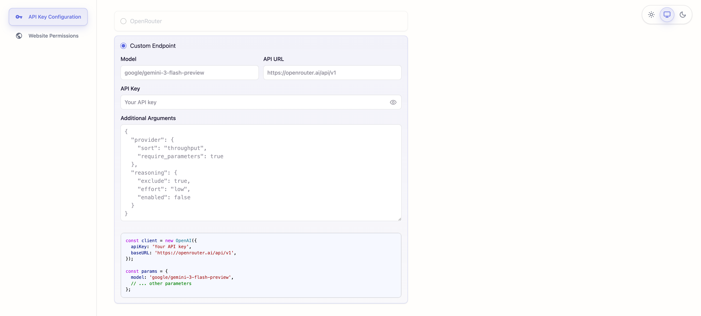
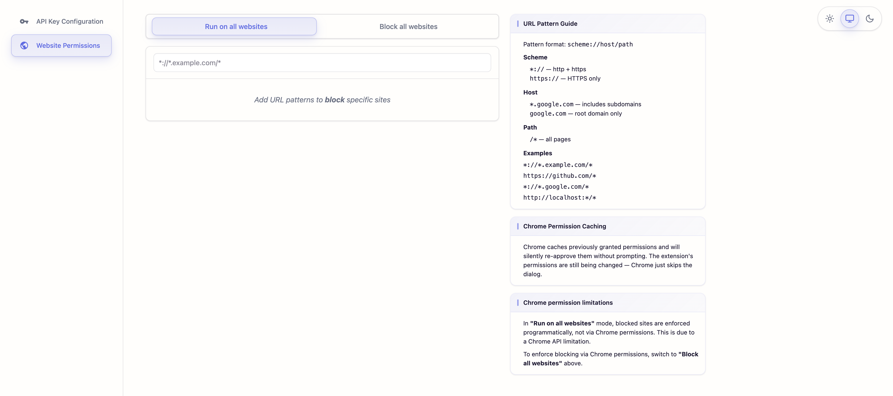

# Hover

Hover over code on any webpage to see documentation. Like your IDE, but everywhere.

Works on documentation sites and AI chat apps like ChatGPT and Claude.

<p align="center">
  
</p>

<p align="center">
  
</p>

---

## Setup

**Note:** This extension is coming to the chrome web store soon

### 1. Build the extension

```bash
pnpm install && pnpm build
```

### 2. Load in Chrome

Navigate to `chrome://extensions` → Enable **Developer Mode** → **Load Unpacked** → Select the `dist_chrome` folder

### 3. Configure API

Click the extension icon, go to **Settings**, and add your [OpenRouter](https://openrouter.ai) API key or configure a custom OpenAI client compatible endpoint.

#### OpenRouter


#### Custom Endpoint



### 4. Configure websites

Set which websites the extension runs on using URL patterns (e.g. `*://*.github.com/*`).



---

## Development

```bash
pnpm dev      # Dev server
pnpm build    # Production build and lint
pnpm lint     # Lint
pnpm format   # Format
```

Optional: Create `.env` to bundle an API key into dev builds:

```
VITE_OPEN_ROUTER_API_KEY=your-key
```

## Testing

See [scripts/README.md](scripts/README.md) for evaluation tools.

## Known Issues & Future Improvements

See [TASKS.md](TASKS.md) for a list of known issues and planned improvements.

## License

MIT
